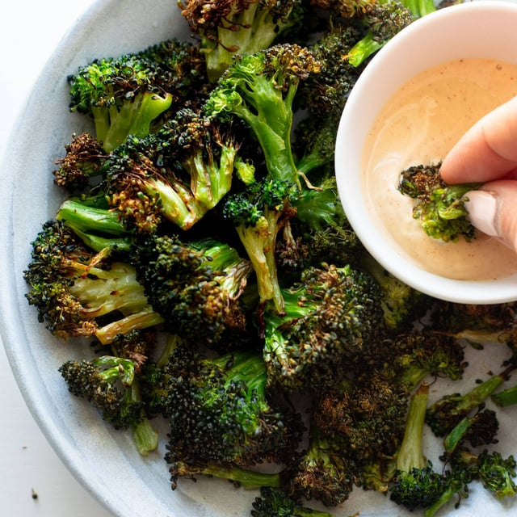

# FoodZ Recipe

A modern, responsive recipe website built with Next.js and Tailwind CSS. FoodZ Recipe allows users to browse, search, and filter recipes by category, view detailed recipe information, and create accounts to save their favorite recipes.



## Features

- Responsive design that works on desktop, tablet, and mobile devices
- Browse recipes by categories such as Quick and Easy, Vegetarian, Soup, etc.
- View top-rated and latest recipes
- Search functionality to find recipes by keywords
- User authentication (login/signup)
- Clean, modern UI with a focus on food photography

## Tech Stack

- **Framework**: [Next.js 14](https://nextjs.org/) with App Router
- **Styling**: [Tailwind CSS](https://tailwindcss.com/)
- **Icons**: SVG icons and custom icons
- **Fonts**: Google Fonts with Next.js font optimization
- **Deployment**: Can be deployed on Vercel, Netlify, or any hosting service supporting Next.js

## Getting Started

### Prerequisites

- Node.js 18.x or later
- npm or yarn or pnpm

### Installation

1. Clone the repository:

```bash
git clone url
cd foodz-recipe/frontend
```

2. Install dependencies:

```bash
npm install
```

3. Run the development server:

```bash
npm run dev
```

4. Open [http://localhost:3000](http://localhost:3000) with your browser to see the result.

## Project Structure

```
frontend/
├── app/                      # Next.js App Router
│   ├── about/                # About page
│   ├── components/           # Reusable UI components
│   ├── login/                # Login page
│   ├── recipes/              # Recipe pages
│   ├── signup/               # Signup page
│   ├── globals.css           # Global styles
│   ├── layout.tsx            # Root layout
│   └── page.tsx              # Home page
├── public/                   # Static assets
│   ├── images/               # Image files
│   │   ├── categories/       # Category images
│   │   ├── icons/            # Icon assets
│   │   └── recipes/          # Recipe images
├── tailwind.config.js        # Tailwind CSS configuration
└── next.config.js            # Next.js configuration
```

## Key Components

- **Header**: The main navigation component with links to Home, About, Recipes, and Login
- **RecipeCard**: Displays individual recipe previews with image, title, and metadata
- **CategorySection**: Shows recipe categories with images
- **FeaturedRecipes**: Highlights selected recipes in a grid layout
- **LatestRecipes**: Shows the most recent recipes added to the site

## Pages

- **Home** (`/`): Landing page with featured and latest recipes
- **About** (`/about`): Information about FoodZ Recipe and its creator
- **Recipes** (`/recipes`): Browse all recipes with filter options
- **Recipe Detail** (`/recipes/[id]`): Detailed view of a specific recipe
- **Login** (`/login`): User login page
- **Signup** (`/signup`): User registration page

## Authentication


